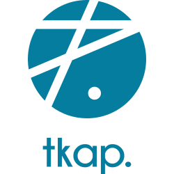

# tKAP

<p align="center">
  
</p>


tKAP is a set of Terraform modules designed to get you everything
you need to run a production Kapsule cluster on Scaleway Element. It ships with
sensible defaults, and add a lot of common addons with their configurations that
work out of the box.

## Terraform

* :heavy_check_mark: Terraform implementation is available in the [`terraform`](./terraform) folder.

### Requirements

* [Terraform](https://www.terraform.io/downloads.html)
* [direnv](https://direnv.net/#basic-installation): available in every Linux distribution, :warning: do not forget the [shell hook installation](https://direnv.net/docs/hook.html)
* [tfenv](https://github.com/cloudposse/tfenv)
* [scalway-cli](https://github.com/scaleway/scaleway-cli) configured for your
    scaleway account
* A [Scaleway object storage bucket](https://console.scaleway.com/object-storage/buckets) to store Terraform state files
* (Optional) A [scaleway DNS zone](https://console.scaleway.com/domains/external) if you want to have dynamic DNS

### QuickStart

This repository is a template that can
[used](https://github.com/particuleio/tkap/generate) to deploy this repository
in your own Github namespace.

Terraform configuration is done inside the [`live`](./terraform/live) folder.

1. Create a `credentials.sh` file that WILL NOT be commited to git with your
   credentials (it is possible to use other means of authentication like aws
   profile for the S3 credentials and scaleway cli configuration file for
   scaleway provider, keep in mind that no matter how you do it, you need the
   AWS credential for S3 backend and scaleway credentials loaded):

  ```bash
  export SCW_ACCESS_KEY=SCW_ACCESS_KEY
  export SCW_SECRET_KEY=SCW_SECRET_KEY
  export SCW_DEFAULT_ORGANIZATION_ID=SCW_DEFAULT_ORGANIZATION_ID
  export SCW_DEFAULT_PROJECT_ID=SCW_DEFAULT_PROJECT_ID

  export AWS_ACCESS_KEY_ID=AWS_ACCESS_KEY_ID
  export AWS_SECRET_ACCESS_KEY=AWS_SECRET_ACCESS_KEY
  ```

2. source the `credentials.sh` file

  ```console
  source credentials.sh
  ```

3. Add your Scaleway object storage bucket name in [`./terraform/live/shared/backend.tf`](./terraform/live/shared/backend.tf)

  ```hcl
  terraform {
    backend "s3" {
      bucket                      = "tkap-terraform-remote-state"
      region                      = "fr-par"
      endpoint                    = "https://s3.fr-par.scw.cloud"
      skip_region_validation      = true
      skip_credentials_validation = true
    }
  }
  ```

4. Edit the [`./terraform/live/global_values.yaml`](./terraform/live/global_values.yaml) to suit your needs:

  ```yaml
  ---
  default_domain_name: scw.particule.cloud
  prefix: pio
  project: tkap
  tf_state_bucket_region: fr-par
  tf_state_bucket_name: tkap-terraform-remote-state
  ```

5. Copy the demo environment:

```console
cp -ar demo-s3 production

tree production
 .
├──  env_tags.yaml
└──  fr-par
   ├──  clusters
   │  └──  full
   │     ├──  cluster_values.yaml
   │     ├──  kapsule
   │     │  ├──  backend.tf -> ../../../../../shared/backend.tf
   │     │  ├──  locals.tf -> ../../../../../shared/locals.tf
   │     │  ├──  main.tf
   │     │  ├──  scw-provider.tf -> ../../../../../shared/scw-provider.tf
   │     │  └──  versions.tf
   │     └──  kapsule-addons
   │        ├──  backend.tf -> ../../../../../shared/backend.tf
   │        ├──  data.tf
   │        ├──  locals.tf -> ../../../../../shared/locals.tf
   │        ├──  main.tf
   │        └──  versions.tf
   └──  region_values.yaml
```

6. Add environment name in `env_tags.yaml` to match your environment

7. Inside `kapsule` folder run:
  * `terraform init`
  * `terraform plan`
  * `terrafrom apply`

8. To get the `kubeconfig` file for the cluster:

  ```console
  terraform output -raw kubeconfig
  ```

9. Inside `kapsule-addons` run:
  * `terraform init`
  * `terraform plan`
  * `terrafrom apply`

## Main purposes

The main goal of this project is to glue together commonly used tooling with Kubernetes/Kapsule and to get from a scaleway account to a production cluster with everything you need without any manual configuration.

## What you get

A production cluster all defined in IaaC with Terraform:

* Kapsule cluster base on [`terraform-scaleway-kapsule`](https://github.com/particuleio/terraform-scaleway-kapsule)
* Kubernetes addons based on [`terraform-kubernetes-addons`](https://github.com/particuleio/terraform-kubernetes-addons): provides various addons that are often used on Kubernetes and specifically on EKS.

Everything is tied together with Terraform and allows you to deploy a multi cluster architecture in a matter of minutes (ok maybe an hour) and different Scaleway accounts and/or regions for different environments.
