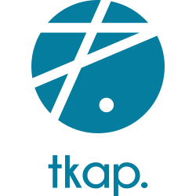

# tKAP

  

<!-- vim-markdown-toc GFM -->

  * [Requirements](#requirements)
* [Pre-commit](#pre-commit)
* [ASDF](#asdf)
* [Main purposes](#main-purposes)
* [What you get](#what-you-get)

<!-- vim-markdown-toc -->

tKAP is a set of Terraform/Terragrunt modules designed to get you everything
you need to run a production Kapsule cluster on Scaleway Element. It ships with
sensible defaults, and add a lot of common addons with their configurations that
work out of the box.

### Requirements

* [Terraform](https://www.terraform.io/downloads.html)
* [Terragrunt](https://github.com/gruntwork-io/terragrunt/releases)
* [scalway-cli](https://github.com/scaleway/scaleway-cli) configured for your
    scaleway account
* A [Terraform Cloud](https://app.terraform.io) to store Terraform state and
    have state locking
* (Optional) A [scaleway DNS zone](https://console.scaleway.com/domains/external) if you want to have dynamic DNS
## Pre-commit

This repository use pre-commit hooks, please see
[this](https://github.com/antonbabenko/pre-commit-terraform#how-to-install) on
how to setup tooling

## ASDF

[ASDF](https://asdf-vm.com/) is a package manager which is great for managing
cloud native tooling. More info [here](https://particule.io/blog/asdf/)(eg.
French).

## Main purposes

The main goal of this project is to glue together commonly used tooling with Kubernetes/Kapsule and to get from a scaleway account to a production cluster with everything you need without any manual configuration.

## What you get

A production cluster all defined in IaaC with Terraform:

* Kapsule cluster base on [`terraform-scaleway-kapsule`](https://github.com/particuleio/terraform-scaleway-kapsule)
* Kubernetes addons based on [`terraform-kubernetes-addons`](https://github.com/particuleio/terraform-kubernetes-addons): provides various addons that are often used on Kubernetes and specifically on EKS.

Everything is tied together with Terraform and allows you to deploy a multi cluster architecture in a matter of minutes (ok maybe an hour) and different Scaleway accounts and/or regions for different environments.
